# 🛡️ Security Policy

## 🔐 Reporting Security Vulnerabilities

We take security seriously. If you discover a security vulnerability, please report it responsibly.

### 📧 How to Report

**Discord:** Find at our organization profile.


### ⚡ Response Time

- **Critical vulnerabilities:** 24 hours
- **High severity:** 72 hours  
- **Medium/Low severity:** 7 days

## 🏆 Security Features

### 🔒 Zero-Trust Architecture

```mermaid
graph TD
    A[Client Device] -->|Encrypted Blob| B[Server]
    B -->|Encrypted Storage| C[MongoDB]
    B -.->|No Access| D[🚫 Plaintext]
    B -.->|No Access| E[🚫 Keys]
    
    style D fill:#ffebee
    style E fill:#ffebee
    style A fill:#e8f5e8
```



**Server Never Sees:**
- ❌ Plaintext messages
- ❌ Encryption keys
- ❌ User passwords
- ❌ Decrypted metadata

### 🛡️ Multi-Layer Encryption

| Layer | Algorithm | Key Size | Purpose |
|-------|-----------|----------|---------|
| **Layer 1** | AES-256-GCM | 256-bit | Primary encryption |
| **Layer 2** | XChaCha20-Poly1305 | 256-bit | Secondary encryption |
| **Transport** | TLS 1.3 | 256-bit | Network security |

### 🔑 Key Management

- **Client-Side Generation**: All keys generated in browser
- **No Key Transmission**: Keys never sent to server
- **Secure Storage**: Keys encrypted in IndexedDB
- **Forward Secrecy**: Ephemeral session keys

## 🚨 Threat Model

### ✅ Protected Against

| Attack Vector | Protection | Status |
|---------------|------------|--------|
| **Server Compromise** | Zero-trust design | ✅ Secure |
| **Database Breach** | Encrypted storage | ✅ Secure |
| **Network Interception** | Multi-layer encryption | ✅ Secure |
| **Man-in-the-Middle** | TLS + client verification | ✅ Secure |
| **Replay Attacks** | Nonce validation | ✅ Secure |

### ⚠️ Risks & Mitigations

| Risk | Impact | Mitigation |
|------|--------|------------|
| **Device Theft** | High | Password-protected keys |
| **Browser Vulnerabilities** | Medium | Regular updates required |
| **Social Engineering** | High | User education |
| **Quantum Computing** | Future | Post-quantum crypto planned |

## 🔍 Security Audit

### 📋 Checklist

- [x] **Encryption**: Multi-layer AES + XChaCha20
- [x] **Key Management**: Client-side only
- [x] **Transport Security**: TLS 1.3
- [x] **Input Validation**: All API endpoints
- [x] **Error Handling**: No sensitive data leakage
- [x] **Dependencies**: Regular security updates

### 🧪 Testing

```bash
# Run security tests
npm run test:security

# Check dependencies
npm audit

# Verify encryption
npm run test:crypto
```

## 📜 Compliance

### 🌍 Standards

- **GDPR**: Privacy by design
- **SOC 2**: Security controls
- **ISO 27001**: Information security
- **NIST**: Cryptographic standards

### 🔐 Cryptographic Standards

- **AES-256**: FIPS 140-2 approved
- **XChaCha20**: RFC 8439 compliant
- **TLS 1.3**: RFC 8446 standard
- **Random Generation**: Cryptographically secure

## 🚫 Known Limitations

1. **Client-Side Trust**: Requires secure client environment
2. **Key Recovery**: No password reset without key loss
3. **Metadata**: Some timing analysis possible
4. **Quantum Resistance**: Current algorithms vulnerable to quantum attacks
---

**Last Updated:** Sep 18, 2025 by @dailker